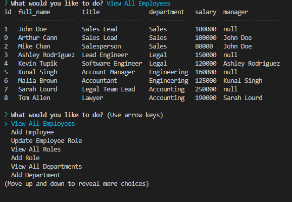

# Employee Tracker

## Description

At work, I train and track multiple employees from multiple departments. This makes searching through the database or even adding to the database super easy, even through the command line.

## Table of Contents

- [Installation](#installation)
- [Usage](#usage)
- [Credits](#credits)
- [License](#license)
- [Tests](#tests)
- [Questions](#questions)
- [Repository](#repository)

## Installation

Please run '$ npm i' in the terminal to install necessary packages

## Usage

### Screenshot of Command Line

### Function Video Link

https://drive.google.com/file/d/13CbBjpGMECgOoepiMPLEZvinNHJeq87F/view

## Credits

N/A

## License

N/A

## Tests

N/A

## Questions?

If any questions/comments regarding this project, here is the author:
https://github.com/artiecannv

## Repository

https://github.com/artiecannv/employee-tracker
